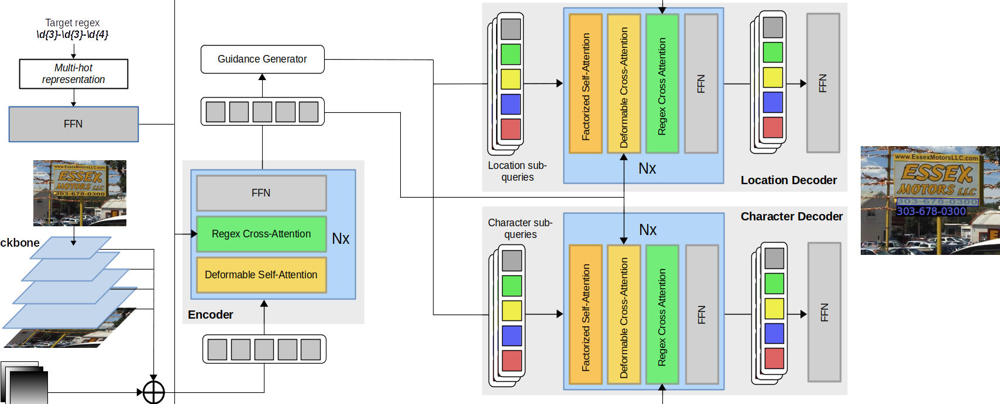

# STEP - Towards Structured Scene-Text Spotting

This repository contains the code and data for the paper [STEP - Towards Structured Scene-Text Spotting](https://arxiv.org/abs/2309.02356)



## Running the Code

### Code and Environment Setup

Use the following commands to clone and create the environment with conda:

```bash
git clone https://github.com/CVC-DAG/STEP.git
cd STEP
conda create -n STEP python=3.8 -y
conda activate STEP
conda install pytorch==1.10.1 torchvision==0.11.2 cudatoolkit=11.3 cudatoolkit-dev=11.3 -c pytorch -c conda-forge
python -m pip install scipy numba
python -m pip install detectron2 -f https://dl.fbaipublicfiles.com/detectron2/wheels/cu113/torch1.10/index.html
python setup.py build develop
```

### Datasets

Our proposed approach uses [HierText-based](https://github.com/google-research-datasets/hiertext) training 
and validation splits. The training and validation images can be downloaded using
the [AWS CLI interface](https://docs.aws.amazon.com/cli/latest/userguide/getting-started-install.html):

````bash
mkdir datasets
mkdir datasets/hiertext
aws s3 --no-sign-request cp s3://open-images-dataset/ocr/train.tgz datasets/hiertext
aws s3 --no-sign-request cp s3://open-images-dataset/ocr/validation.tgz datasets/hiertext
tar -xzvf datasets/hiertext/train.tgz -C datasets/hiertext/
tar -xzvf datasets/hiertext/validation.tgz -C datasets/hiertext/
````

Our pipeline uses custom training and validation ground truths. The ground truth files can be downloaded 
with the following script:

````bash
wget http://datasets.cvc.uab.cat/STEP/structured_ht.zip -P datasets/hiertext
unzip datasets/hiertext/structured_ht.zip -d datasets/hiertext
````

Finally, our proposed test set can be downloaded with:

````bash
wget http://datasets.cvc.uab.cat/STEP/structured_test.zip -P datasets
unzip datasets/structured_test.zip -d datasets
````

The license plate images are sourced from the [UFPR-ALPR](https://github.com/raysonlaroca/ufpr-alpr-dataset)
dataset. The images of this dataset are licensed for non-commercial use and you need to request access 
to the authors (instructions are included in the linked repository).
The images we used are the first frames of each one of the sequences. Supposing that you have
been given access to the UFPR-ALPR dataset, you can download, unzip and copy these frames with:

```bash
wget https://redacted/UFPR-ALPR.zip # change it to the actual download link
unzip UFPR-ALPR.zip
cp UFPR-ALPR\ dataset/*/*/*\[01\].png datasets/structured_test/
# cp UFPR-ALPR\ dataset/**/*\[01\].png datasets/structured_test/ # for zsh
# rm -r UFPR-ALPR\ dataset/  # optionally
```

### Test Dataset Format

The dataset format follows the [labelme](https://github.com/labelmeai/labelme/tree/main) annotation
format. The "label" field of every annotation is its type/class of code (UIC, BIC, tonnage, etc.). The
field "transcription" contains the transcription of the instance. The following table specifies the 
label of every type of code and its regular expression:

| Class  | Regular Expression | Label |
| ------------- | ------------- | ------------- |
| BIC  | \\[A-Za-z]{4}\\s\\d{6}\\s\\d  | bic |
| UIC  | \\d{2}\\s?\\d{2}\\s?\\d{4}\\s?\\d{3}\\-\\d  | uic |
| TARE  | \\d{2}[.]?\\d{3}\\s?(?i)kg  | tare |
| Phone Num.  | \\d{3}[-.\\s]?\\d{3}[-.\\s]?\\d{4} | phone |
| Tonnage  | \\d{2}[.]?\\d?[t] | tonnage |
| License Plate  | \\[A-Z]{3}\\s\\d{4} | lp |

### Model Weights

The TESTR pretrained on HierText (which are used to initialise the model) and STEP's
final weights can be downloaded with:
```bash
mkdir ckp
wget http://datasets.cvc.uab.es/STEP/TESTR_pretrain_ht_final.pth -P ckp
wget http://datasets.cvc.uab.es/STEP/STEPv1_final.pth -P ckp
```

They should be placed under the ``ckp`` directory, although you can place them anywhere else, but you 
should change the arguments of the example script calls below.

## Running the Model

The model can be trained with the following script (needs the TESTR pretrained weights linked above
in the ``ckp`` folder):

```bash
python tools/train_net.py --config-file configs/STEP/hiertext/STEP_R_50_Polygon.yaml --num-gpus 2
```

To run the validation script:

```bash
python inference/eval.py --config-file configs/STEP/hiertext/STEP_R_50_Polygon.yaml --opts MODEL.WEIGHTS ckp/STEPv1_final.pth MODEL.TRANSFORMER.INFERENCE_TH_TEST 0.3
 ```

Finally, to run the test script on our proposed test dataset:

```bash
python inference/test.py --config-file configs/STEP/hiertext/STEP_R_50_Polygon.yaml --opts MODEL.WEIGHTS ckp/STEPv1_final.pth MODEL.TRANSFORMER.INFERENCE_TH_TEST 0.3
```

## Create Your Own Queries


You can build your own queries with the code found in the file ```adet/utils/queries.py```. 
These queries are used in the inference files to find the target text in the image.
This file contains several functions, but we will only need the ```generate_query``` function.
This function has two arguments, ```types``` and ```mask_force```. ```types``` has to be a string.
Each character of the string represents the type of the character that we want to match in each
position. This is the list of character types that we can specify:

* s: space(``[ ]`` in regex)
* e: separator symbols
* p: special characters
* l: letters (``[A-Za-z]`` in regex)
* n: numbers (``\d`` in regex)

The ```queries.py``` file has the full list of characters for each character type. Besides targeting 
these general character types, you can also use ```mask_force``` to force specific characters. If for 
example you want the target string to start with the character 'a', the first char of ```types``` 
will be 'a'. To indicate that you want to force that character at position 0, the first element of 
```mask_force``` will be 1. The length of ```mask_force``` must be equal to the length of ```types```.
The elements of ```mask_force``` will be 0 if you want to use the general character types. Here are
some examples where we are using the general character types to match strings:

* ```generate_query("nnnll", [0, 0, 0, 0, 0])```: matches any string with three numbers and two letters,
the equivalent regex would be ```\b\d{3}[A-Za-z]{2}\b```.
* ```generate_query("ensll", [0, 0, 0, 0, 0])```: matches any string starting with a "separator" character 
  (characters ',', '-' or '_') a number, a space, and two letters. The equivalent regex would 
  be ```\b[,-_]\d[ ][A-Za-z]{2}\b```.

Here are some examples where we match specific characters at certain positions:

* ```generate_query("nnnnnKG", [0, 0, 0, 0, 0, 1, 1])```: matches any string with five numbers 
  and the letters "KG", the equivalent regex would be ```\b\d{5}KG\b```.
* ```generate_query("nnKn", [0, 0, 1, 1])```: matches any string with two numbers and the letters
  "Kn", the equivalent regex would be ```\b\d{2}Kn\b```. Notice how the letter 'n' can be used as a 
  general character type for numbers, but in this case we're forcing the actual character 'n' in the
  last position of the query.
* ```generate_query("TARA", [1, 1, 1, 1])```: matches the exact word "TARA", the equivalent regex 
  would be ```\bTARA\b```.

If you use a character type that is not listed above, and the mask is set to 0 in that position,
the code will raise an exception. For example, the query ```generate_query("nnnr", [0, 0, 0, 0])```
is not valid because "r" is not a valid character type, and the mask is set to 0 in its position.

We can also target multiple specific characters at a certain position, but requires a bit more work. 
Let's say we want to encode the regex ```\b\d{2}[Kk][Nn]\b```, where the last two letters can be
uppercase and lowercase. In this case we can add the two expression where we target both representations
and clamp the result between 0 and 1:

```python
query1 = generate_query("nnkn", [0, 0, 1, 1])
query2 = generate_query("nnKN", [0, 0, 1, 1])
query = torch.clamp(query1 + query2, max=1)
```

These queries are given to the model. An example of their usage can be seen in the script
``inference/demo.py``, line 90. You can run this script with:

```bash
python inference/demo.py --config-file configs/STEP/hiertext/STEP_R_50_Polygon.yaml --input <PATH_TO_THE_IMAGES> --opts MODEL.WEIGHTS ckp/STEPv1_final.pth MODEL.TRANSFORMER.INFERENCE_TH_TEST 0.3
```

You can save the result in a folder with the flag ```--output <OUTPUT_PATH>```.

## License

This repository is released under the Apache License 2.0. Check the [LICENSE](LICENSE) file, dawg.

## Acknowledgements

We thanks [AdelaiDet](https://github.com/aim-uofa/AdelaiDet) training and inference framework 
and the authors of [TESTR](https://github.com/mlpc-ucsd/TESTR) for their code and work.
